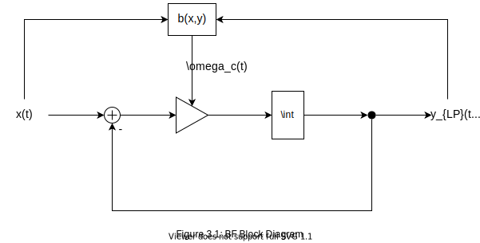
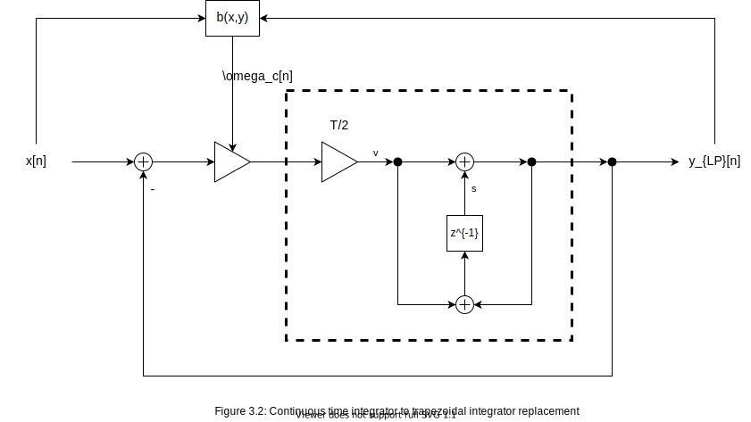

# VirtualAnalogCompressors

## 1. Introduction

## 2. Compressor Review

## 3. Ballistics Filter

The ballistics filter is a modified first order low pass filter. Thus, any unmentioned details are implied to be the same as in a regular TPT first order low pass implementation.

In continuous time, the cutoff switches between the attack and release values according to the branching function, b(x,y):

Not only does this characteristic add another feedback loop, it adds a nonlinearity: the unit step function.

After integrator discretization, the overall integrator gain is:

Therefore, the BF solution is the LPF solution, but with an extra step to choose the right g value during the calcution of v. The derivation for v starts again with the zero delay feedback equation for y:

Combining (3.2) and (3.3) defines an implicit nonlinear function of y (note that x and s are constants):

Another way to express (3.5) is as a root finding problem:

Graphically, f(y) consists of two lines that meet at a nondifferentiable knee. The root of this line is the solution for y. The value of g to use will be the one associated with the line crossing f(y) = 0.

[Interactive f(y) Graph](geogebra.org/graphing/qckh8h8x)

Rewriting (3.5) shows that '+s' adds to the f(y) value of the knee (as well as the entire function) and '-y' moves the knee up and down depending on its y coordinate:

The y coordinate of the discontinuity in (3.2) shifts by x. In the case of 'gy', this shifts the knee by x and reduces the f(y) coordinate by omega_a times x. 'gx' adds omega_a times x to the f(y) corrdinate of the knee. Thus, a change in x adds x to the y coordinate in the following expression:

As a result the f(y) coordinate changes by -x due to the addition of '-y' in (3.6). Therefore, the f(y) coordinate of the knee is s-x. More importantly, the condition to use g_a is s-x<0. The final algorithm is:

//Ga = ga/(1+ga),

//Gr = gr/(1+gr)  

G = (s<x)?Ga:Gr;

v = (x-s)*G;

y = v+s;

s = y+v;

## 4. Feedback VCA

## 4. Traditional Digital Compressor
